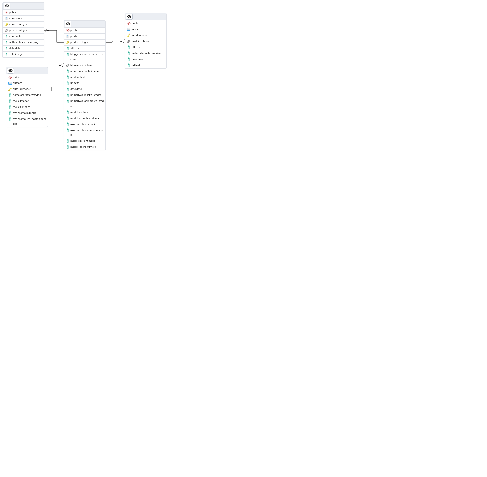

# Neo4j vs PostgreSQL

[Data link](https://www.kaggle.com/datasets/lakritidis/identifying-influential-bloggers-techcrunch?resource=download)

## Database Schema

[Link for postgress](https://www.mssqltips.com/sqlservertip/8295/postgresql-monitoring-with-pg-stat-statements/)
